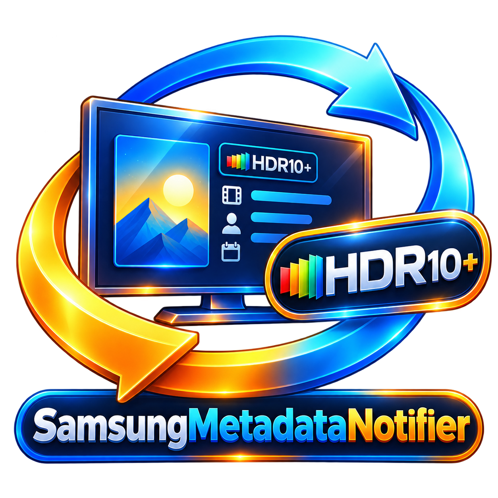

# Jellyfin Plugins

A personal fork of [Atilil/jellyfin-plugins](https://github.com/Atilil/jellyfin-plugins), maintained for my own media server. This fork contains a small set of personal maintenance changes. It is not an official Jellyfin project and is not affiliated with or endorsed by Jellyfin or the original project.

## Installation

1. Open Jellyfin and go to **Administration → Dashboard → Plugins → Repositories**
2. Click **Add** and enter:
    - **Name:** `Personal Jellyfin Plugins`
    - **URL:** `https://raw.githubusercontent.com/eagleeyetom/jellyfin-plugins/refs/heads/main/manifest.json`
3. Click **Save**
4. Go to **Catalog** tab and install the plugins you want
5. Restart Jellyfin

## Available Plugins

### JellyTag

    

Adds quality badges for resolution, HDR, video codec, audio, languages, and subtitles to media posters and thumbnails. Badges are applied server-side via HTTP middleware, visible on all Jellyfin clients without client-side configuration.

**Features:**
- Automatic quality detection from video metadata
- Samsung/Tizen TV detection with Dolby Vision filtering and HDR10+ preservation
- Configurable badge position, size, and margin per image type
- Support for posters and thumbnails
- Custom SVG, PNG, and JPEG badges
- File-based image caching for performance
- Works on all clients (web, mobile, TV, Kodi)

[More details](Jellytag/README.md)

---

### Metadata Notifier

    

Sends on-screen toast notifications when playback starts on any client, displaying HDR metadata systems (HDR10+, Dolby Vision, HDR10, HLG, SDR), audio codecs (TrueHD Atmos, DTS-HD MA), and transcoding status.

**Features:**
- Multi-client support (Samsung TVs, web, mobile, etc.)
- HDR, audio codec, and channel detection
- Transcoding status reporting
- Fully configurable display options and duration

[More details](MetadataNotifier/README.md)

---

### Requirements

- Jellyfin 12.0.0 or higher
- .NET 10 SDK (for building)

## License

MIT License - see [LICENSE](LICENSE) file.

## Repository

- **Forked from:** [Atilil/jellyfin-plugins](https://github.com/Atilil/jellyfin-plugins)
- **Fork maintenance:** eagleeyetom

---

## Disclaimer

This project was developed with the assistance of AI (Claude by Anthropic). The code has been reviewed, tested, and validated before publication.
